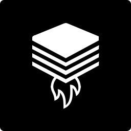

  
   

<h1 align="center" style="margin-bottom: 0px; padding-bottom: 0px;">My Stack - Share Your Technical Skills With the World</h1>

<!-- ALL-CONTRIBUTORS-BADGE:START - Do not remove or modify this section -->

<!-- ALL-CONTRIBUTORS-BADGE:END -->

**My Stack** gives you the possibility to share your technical skills with the world in an easy manner.

## Demo 👾

The current state of my-stack is always deployed at:

- https://mystack.letz.dev (master)
- https://develop.mystack.letz.dev (develop)

If you want to try it out on your local machine/server you can just fire up the `docker-compose.yml` from this repository with `docker-compose up -d`.

## Development 💻

### Prerequisites

To be able to run **My Stack** on your local machine please make sure that you have installed the following software:

- _Docker 20.10.17_
- _node v16.16.0_
- _npm 8.19.2_

### Getting Started

1. Clone the repository by running `git clone https://github.com/jarmee/my-stack.git`
2. Open the root folder of this project and run `npm install`

#### Starting the API

3. After all dependencies were installed execute `docker-compose up`. This will startup the database (PostgreSQL).
4. Now you are ready to start the api. Run `nx serve api` and you are good to go. To see if everything is up and running open your browser and navigate to `http://localhost:3333/api/stacks` or run `curl http://localhost:3333/api/stacks`. You should see the following output `[]`;

#### Starting the Client

5. To Start the client SPA carry out the following command `nx serve client`. The SPA should be reachable under `http://localhost:4200`. You can login into My Stack by using the subsequent credentials:

- User: `simple-user`
- Password: `password`

### Testing 🧪

If you would like to verify if the changes you made do not cause any problems you can do it by running the tests of the workspace. To run all of the tests of this workspace carry out `nx run-many --all --target=test --parallel=3`. To run a the tests of an application or library run `nx test [NAME]`, e.g. `nx test api`.

## Documentation 📚

For more information about My Stack please see the [documentation](./docs/0_TABLE_OF_CONTENTS.md).

## Contributors ✨

Thanks goes to these wonderful people ([emoji key](https://allcontributors.org/docs/en/emoji-key)):

<!-- ALL-CONTRIBUTORS-LIST:START - Do not remove or modify this section -->
<!-- prettier-ignore-start -->
<!-- markdownlint-disable -->
<table>
  <tbody>
    <tr>
      <td align="center"><a href="https://github.com/jarmee"> <b>jarmee</b></a> <a href="https://github.com/jarmee/my-stack/commits?author=jarmee" title="Code">💻</a> <a href="https://github.com/jarmee/my-stack/commits?author=jarmee" title="Tests">⚠️</a></td>
      <td align="center"><a href="https://github.com/florianehmke"> <b>Florian Ehmke</b></a> <a href="https://github.com/jarmee/my-stack/commits?author=florianehmke" title="Code">💻</a> <a href="https://github.com/jarmee/my-stack/commits?author=florianehmke" title="Tests">⚠️</a> <a href="#infra-florianehmke" title="Infrastructure (Hosting, Build-Tools, etc)">🚇</a></td>
    </tr>
  </tbody>
</table>

<!-- markdownlint-restore -->
<!-- prettier-ignore-end -->

<!-- ALL-CONTRIBUTORS-LIST:END -->

This project follows the [all-contributors](https://github.com/all-contributors/all-contributors) specification. Contributions of any kind welcome!
